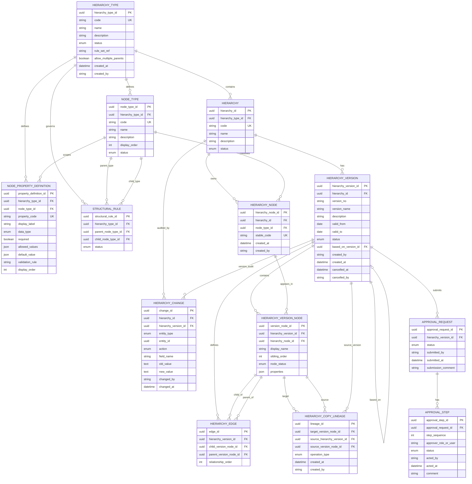

# Hierarchy Management System — datamodel.md Plan

## Context

| ERD (diagram)           | Spec entity                                                                       |
| ----------------------- | --------------------------------------------------------------------------------- |
| Hierarchy Master        | `HIERARCHY`                                                                       |
| Structure Versions      | `HIERARCHY_VERSION` + `HIERARCHY_EDGE`                                            |
| Structure Node Versions | `HIERARCHY_VERSION_NODE`                                                          |
| Node Master             | `HIERARCHY_NODE`                                                                  |
| Node Properties         | `HIERARCHY_VERSION_NODE.properties` (JSON) governed by `NODE_PROPERTY_DEFINITION` |
| Audit Table             | `HIERARCHY_CHANGE`                                                                |

The spec expands the diagram with configuration (`HIERARCHY_TYPE`, `NODE_TYPE`, `STRUCTURAL_RULE`), workflow (`APPROVAL_REQUEST`, `APPROVAL_STEP`), and lineage (`HIERARCHY_COPY_LINEAGE`).

### Removed from prior draft (not required by SCM feature list)

| Removed | Reason |
| ------- | ------ |
| `HIERARCHY_CLOSURE` | Cycle prevention is enforced at write time; closure is a performance cache, not a feature requirement |
| `HIERARCHY.start_dt`, `HIERARCHY.end_dt` | Effective dating lives on `HIERARCHY_VERSION`; master has no date-scoped behavior in features |
| `HIERARCHY_TYPE.updated_at` | Config changes are auditable via `HIERARCHY_CHANGE`; single `created_at`/`created_by` suffices on type |
| `HIERARCHY_TYPE.overlap_policy` | Overlap validation is a business rule applied to version date ranges; no need for a separate enum on type |
| `NODE_PROPERTY_DEFINITION.searchable` | No property-search feature in scope; historical lookup is by business date on versions |
| `STRUCTURAL_RULE.allow_multiple_parents` | Tree vs. DAG is configured once per hierarchy type (`HIERARCHY_TYPE.allow_multiple_parents`) |
| `HIERARCHY_VERSION.submitted_at`, `approved_by`, `approved_at`, `rejection_reason` | Submit/approve/reject detail lives in `APPROVAL_REQUEST` + `APPROVAL_STEP`; version keeps `status` only |
| `APPROVAL_REQUEST.comparison_base_version_id` | Compare base is derived at runtime (typically `based_on_version_id` or current ACTIVE version) |
| `HIERARCHY_VERSION_NODE.created_at`, `updated_at` | Structural/property edits are captured in append-only `HIERARCHY_CHANGE` |

---

## Deliverable

Create **`[datamodel.md](/Users/relanto/Desktop/SPM/datamodel.md)`** with the sections below.

### 1. Document header and scope

- Purpose: logical (technology-agnostic) data model for hierarchy setup, versioning, structure maintenance, flexible properties, approval lifecycle, compare/audit/retrieval.
- Traceability note mapping entities to SCM feature areas (Setup, Version Management, Node & Structure, etc.).
- Reference to the training scenario (V1/V2 Global Sales) as a worked example at the end.

### 2. Design principles

- **Stable identity vs. version snapshot**: `HIERARCHY_NODE` is long-lived; `HIERARCHY_VERSION_NODE` + `HIERARCHY_EDGE` capture per-version structure and attributes.
- **Immutability by status**: APPROVED / ACTIVE / RETIRED versions are read-only to standard authors.
- **Soft removal**: nodes removed from a draft do not delete historical version data (`node_status = REMOVED`).
- **Governed flexibility**: property payloads are JSON but keys/types/validation come from `NODE_PROPERTY_DEFINITION`.
- **Temporal correctness**: business-date lookup uses `valid_from` / `valid_to` + lifecycle status on `HIERARCHY_VERSION`, not audit timestamps.
- **Single source for workflow detail**: approval actors, timestamps, and rejection reasons are stored only in approval tables; `HIERARCHY_VERSION.status` is the lifecycle summary.

### 3. Entity-relationship overview (Mermaid ER diagram)

Canonical diagram — **12 entities**, relationships, and full column lists with `PK`, `FK`, and `UK` markers:



**Diagram conventions**:

- `PK` — primary key
- `FK` — foreign key
- `UK` — unique constraint (may be composite; see entity detail)
- Composite / scoped uniques not expressible as single-column `UK` in Mermaid:
  - `HIERARCHY`: UK `(hierarchy_type_id, code)`
  - `NODE_TYPE`: UK `(hierarchy_type_id, code)`
  - `NODE_PROPERTY_DEFINITION`: UK `(hierarchy_type_id, node_type_id, property_code)`
  - `HIERARCHY_NODE`: UK `(hierarchy_id, stable_code)` where `stable_code` is not null
  - `HIERARCHY_VERSION_NODE`: UK `(hierarchy_version_id, hierarchy_node_id)`
  - `STRUCTURAL_RULE`: UK `(hierarchy_type_id, parent_node_type_id, child_node_type_id)`
  - `HIERARCHY_EDGE`: UK `(hierarchy_version_id, child_version_node_id, parent_version_node_id)`; for trees also UK `(hierarchy_version_id, child_version_node_id)`

**Self-referential FK**: `HIERARCHY_VERSION.based_on_version_id` → `HIERARCHY_VERSION.hierarchy_version_id`.

**ERD mapping** (baseline diagram → expanded entities):

| ERD column | Expanded entity.column |
|---|---|
| `Hier_ID` | `HIERARCHY.hierarchy_id` PK |
| `Struct Ver ID` | `HIERARCHY_VERSION.hierarchy_version_id` PK |
| `Node_Ver_ID` | `HIERARCHY_VERSION_NODE.version_node_id` PK |
| `Parent_Node_Ver_ID` | `HIERARCHY_EDGE.parent_version_node_id` FK |
| `Node_ID` | `HIERARCHY_NODE.hierarchy_node_id` PK |
| `Audit ID` / `Audit Column Name` | `HIERARCHY_CHANGE.change_id` PK / `field_name` |

### 4. Configuration domain (Setup & Configuration)

#### `HIERARCHY_TYPE`

| Column | Type | Notes |
| ------ | ---- | ----- |
| hierarchy_type_id | PK | |
| code | UK | e.g. `SALES`, `CUSTOMER` |
| name | | |
| description | | |
| status | enum | ACTIVE, INACTIVE |
| rule_set_ref | | optional external rule-set reference |
| allow_multiple_parents | boolean | false = tree (single parent); true = DAG |
| created_at | datetime | |
| created_by | | |

#### `HIERARCHY`

| Column | Type | Notes |
| ------ | ---- | ----- |
| hierarchy_id | PK | maps to ERD `Hier_ID` |
| hierarchy_type_id | FK | |
| code | UK scoped | unique per `(hierarchy_type_id, code)` |
| name | | |
| description | | |
| status | enum | ACTIVE, INACTIVE |

#### `NODE_TYPE`

| Column | Type | Notes |
| ------ | ---- | ----- |
| node_type_id | PK | |
| hierarchy_type_id | FK | |
| code | UK scoped | e.g. `REGION`, `TERRITORY` |
| name | | |
| description | | |
| display_order | int | |
| status | enum | ACTIVE, INACTIVE |

#### `NODE_PROPERTY_DEFINITION`

| Column | Type | Notes |
| ------ | ---- | ----- |
| property_definition_id | PK | |
| hierarchy_type_id | FK | |
| node_type_id | FK nullable | null = applies to all node types in hierarchy type |
| property_code | UK scoped | e.g. `annualQuota` |
| display_label | | |
| data_type | enum | STRING, NUMBER, DECIMAL, DATE, BOOLEAN, ENUM, REFERENCE |
| required | boolean | |
| allowed_values | JSON array | for ENUM |
| default_value | JSON | |
| validation_rule | text/JSON | e.g. `>= 0` |
| display_order | int | |

#### `STRUCTURAL_RULE`

| Column | Type | Notes |
| ------ | ---- | ----- |
| structural_rule_id | PK | |
| hierarchy_type_id | FK | |
| parent_node_type_id | FK | |
| child_node_type_id | FK | |
| status | enum | ACTIVE, INACTIVE |

**Constraints**: unique `(hierarchy_type_id, parent_node_type_id, child_node_type_id)`.

Tree vs. DAG enforcement uses `HIERARCHY_TYPE.allow_multiple_parents` (not per-rule).

### 5. Identity and versioning domain (Version Management)

#### `HIERARCHY_NODE` (stable logical identity — ERD Node Master)

| Column | Type | Notes |
| ------ | ---- | ----- |
| hierarchy_node_id | PK | maps to ERD `Node_ID`; never regenerated |
| hierarchy_id | FK | |
| node_type_id | FK | set at first use; immutable |
| stable_code | UK scoped optional | business key `(hierarchy_id, stable_code)` |
| created_at | datetime | |
| created_by | | |

#### `HIERARCHY_VERSION` (ERD Structure Versions header)

| Column | Type | Notes |
| ------ | ---- | ----- |
| hierarchy_version_id | PK | maps to ERD `Struct Ver ID` |
| hierarchy_id | FK | |
| version_no | | e.g. `V1`, `V2` |
| version_name | | |
| description | | change reason / notes |
| valid_from | date | effective start |
| valid_to | date nullable | effective end; null = open-ended |
| status | enum | lifecycle (see below) |
| based_on_version_id | FK self nullable | source version for draft copy |
| created_by | | |
| created_at | datetime | |
| cancelled_at | datetime nullable | draft discard |
| cancelled_by | | draft discard |

**Lifecycle enum**: `DRAFT`, `PENDING_APPROVAL`, `APPROVED`, `ACTIVE`, `REJECTED`, `RETIRED`, `CANCELLED`.

**Read-only enforcement**: APPROVED, ACTIVE, RETIRED are immutable for standard authors; REJECTED returns to editable draft flow via new draft or status transition.

**Overlap constraint**: at most one APPROVED/ACTIVE version may cover a given calendar date per hierarchy (application or DB exclusion on `(hierarchy_id, valid_from, valid_to)` where status ∈ {APPROVED, ACTIVE}).

Submit/approve/reject timestamps and actors: query `APPROVAL_REQUEST` + `APPROVAL_STEP` (not duplicated on version row).

### 6. Structure domain (Node & Structure)

#### `HIERARCHY_VERSION_NODE` (ERD Structure Node Versions)

| Column | Type | Notes |
| ------ | ---- | ----- |
| version_node_id | PK | maps to ERD `Node_Ver_ID` |
| hierarchy_version_id | FK | |
| hierarchy_node_id | FK | reuse logical node across versions |
| display_name | | version-specific label override |
| sibling_order | int | order among siblings |
| node_status | enum | ACTIVE, REMOVED (soft remove) |
| properties | JSON | version-specific values on stable node |

**Unique**: `(hierarchy_version_id, hierarchy_node_id)`.

#### `HIERARCHY_EDGE` (parent-child adjacency)

| Column | Type | Notes |
| ------ | ---- | ----- |
| edge_id | PK | |
| hierarchy_version_id | FK | |
| child_version_node_id | FK | |
| parent_version_node_id | FK nullable | null = root |
| relationship_order | int | ordering when node has multiple parents (DAG) |

**Constraints**:

- Unique `(hierarchy_version_id, child_version_node_id, parent_version_node_id)`.
- When `allow_multiple_parents = false`: unique `(hierarchy_version_id, child_version_node_id)`.
- Cycle prevention: enforced at write time by walking ancestors via edges (no closure table).

### 7. Flexible properties

Document in datamodel.md (not a separate table):

- Storage: `HIERARCHY_VERSION_NODE.properties` JSON object.
- Validation: resolve `NODE_PROPERTY_DEFINITION` by hierarchy type + node type; enforce data_type, required, allowed_values, validation_rule.
- Comparison: diff `properties` JSON for the same `hierarchy_node_id` across two versions.

Example payload:

```json
{
  "territoryCode": "US-ENT-EAST",
  "managerEmployeeId": "E48392",
  "channel": "DIRECT",
  "currency": "USD",
  "annualQuota": 42000000,
  "commissionPlan": "ENT-2028",
  "crmTerritoryId": "SFDC-88217"
}
```

### 8. Approval and lifecycle (Approval & Lifecycle)

#### `APPROVAL_REQUEST`

| Column | Type | Notes |
| ------ | ---- | ----- |
| approval_request_id | PK | |
| hierarchy_version_id | FK | one open request per pending version |
| status | enum | OPEN, COMPLETED, CANCELLED |
| submitted_by | | |
| submitted_at | datetime | |
| submission_comment | text | reason/comments on submit |

#### `APPROVAL_STEP`

| Column | Type | Notes |
| ------ | ---- | ----- |
| approval_step_id | PK | |
| approval_request_id | FK | |
| step_sequence | int | sequential steps |
| approver_role_or_user | | configurable routing target |
| status | enum | PENDING, APPROVED, REJECTED |
| acted_by | | |
| acted_at | datetime | |
| comment | text | approval note or rejection reason |

**Lock semantics**: when `HIERARCHY_VERSION.status = PENDING_APPROVAL`, block structural/property edits until reject (return to DRAFT/REJECTED) or full approval chain completes.

### 9. Lineage, audit, compare (Compare, Audit & Retrieval)

#### `HIERARCHY_COPY_LINEAGE`

| Column | Type | Notes |
| ------ | ---- | ----- |
| lineage_id | PK | |
| target_version_node_id | FK | node in target draft/version |
| source_hierarchy_version_id | FK | |
| source_version_node_id | FK | |
| operation_type | enum | REUSE, CLONE, COPY_SUBTREE |
| created_at | datetime | |
| created_by | | |

#### `HIERARCHY_CHANGE`

| Column | Type | Notes |
| ------ | ---- | ----- |
| change_id | PK | maps to ERD Audit Table |
| hierarchy_id | FK | |
| hierarchy_version_id | FK nullable | |
| entity_type | enum | VERSION, VERSION_NODE, EDGE, PROPERTY, APPROVAL |
| entity_id | uuid | polymorphic reference |
| action | enum | CREATE, UPDATE, COPY, MOVE, SUBMIT, APPROVE, REJECT, ACTIVATE, RETIRE, CANCEL |
| field_name | | maps to ERD `Audit Column Name` |
| old_value | text/JSON | |
| new_value | text/JSON | |
| changed_by | | |
| changed_at | datetime | append-only |

**Compare** (derived, no extra tables): diff `HIERARCHY_VERSION_NODE`, `HIERARCHY_EDGE`, and `properties` between two versions of the same hierarchy. Categories: ADDED, REMOVED, MOVED, RENAMED, PROPERTY_CHANGED, RELATIONSHIP_CHANGED.

**Historical lookup by business date**: `SELECT` version where `status = ACTIVE` (or APPROVED future-dated) and `:business_date BETWEEN valid_from AND COALESCE(valid_to, '9999-12-31')`.

### 10. Indexes and query patterns

| Pattern | Index |
| ------- | ----- |
| Effective-date lookup | `(hierarchy_id, status, valid_from, valid_to)` on `HIERARCHY_VERSION` |
| Version listing | `(hierarchy_id, version_no)` |
| Tree traversal | `(hierarchy_version_id, parent_version_node_id)` on `HIERARCHY_EDGE` |
| Child lookup | `(hierarchy_version_id, child_version_node_id)` on `HIERARCHY_EDGE` |
| Sibling order | `(hierarchy_version_id, parent_version_node_id, sibling_order)` via join |
| Audit trail | `(hierarchy_version_id, changed_at)` on `HIERARCHY_CHANGE` |
| Lineage | `(target_version_node_id)` on `HIERARCHY_COPY_LINEAGE` |

### 11. SCM feature → entity mapping

| Feature area | Primary entities |
| ------------ | ---------------- |
| Setup & Configuration | `HIERARCHY_TYPE`, `HIERARCHY`, `NODE_TYPE`, `NODE_PROPERTY_DEFINITION`, `STRUCTURAL_RULE` |
| Version Management | `HIERARCHY_VERSION` |
| Node & Structure | `HIERARCHY_NODE`, `HIERARCHY_VERSION_NODE`, `HIERARCHY_EDGE`, `HIERARCHY_COPY_LINEAGE` |
| Flexible Properties | `NODE_PROPERTY_DEFINITION`, `HIERARCHY_VERSION_NODE.properties` |
| Validation | enforced in application using config + structure tables |
| Approval & Lifecycle | `HIERARCHY_VERSION`, `APPROVAL_REQUEST`, `APPROVAL_STEP` |
| Compare, Audit & Retrieval | `HIERARCHY_CHANGE`, derived diffs, `HIERARCHY_COPY_LINEAGE` |

### 12. Worked example: Global Sales V1 → V2

- V1 ACTIVE 2027-01-01..2027-12-31: US → Enterprise East, Enterprise West.
- V2 DRAFT from V1 (`based_on_version_id`): split Enterprise West → Pacific + Mountain; copy North America subtree; submit → sequential approve → ACTIVE 2028-01-01; V1 RETIRED.
- Sample queries: effective version on date, version diff categories, lineage for cloned nodes.

### 13. ERD image reference

Embed or link the provided diagram at `[assets/Hierarchy-c90cdd3e-5f0b-4cec-8539-a9c069e60b3c.png](/Users/relanto/.cursor/projects/Users-relanto-Desktop-SPM/assets/Hierarchy-c90cdd3e-5f0b-4cec-8539-a9c069e60b3c.png)` with the mapping table in Section 3.

---

## File to create

| File | Action |
| ---- | ------ |
| `[datamodel.md](/Users/relanto/Desktop/SPM/datamodel.md)` | Create — lean logical data model |

No code, migrations, or DDL scripts in scope unless requested.

---

## Out of scope

- `HIERARCHY_CLOSURE` materialized table (add later only if traversal performance requires it)
- Physical DDL for a specific RDBMS
- API layer or workflow engine integration
