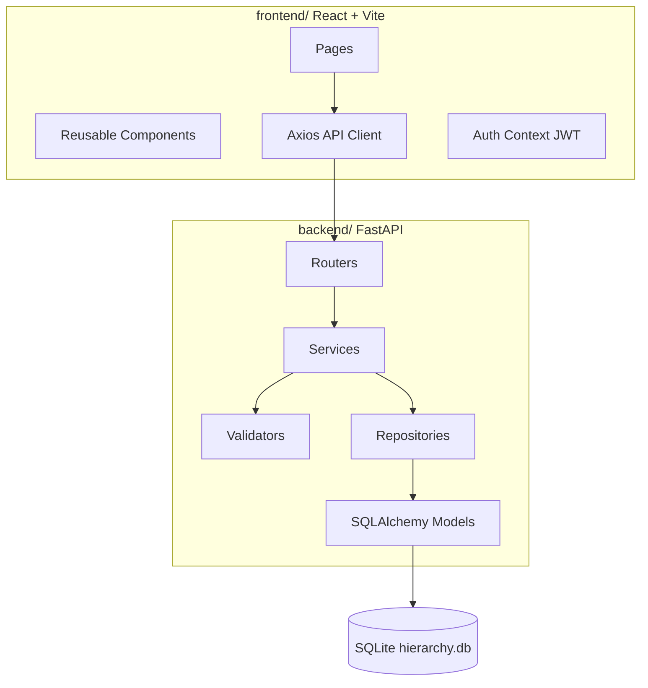
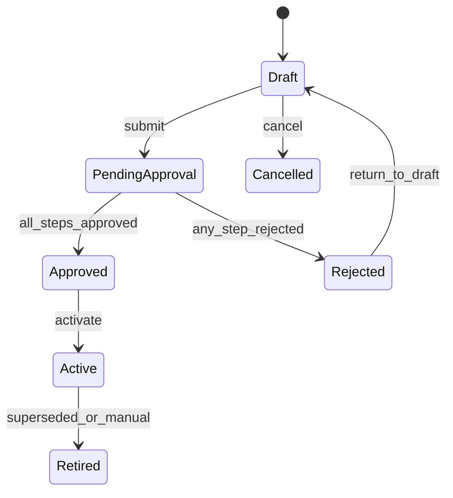
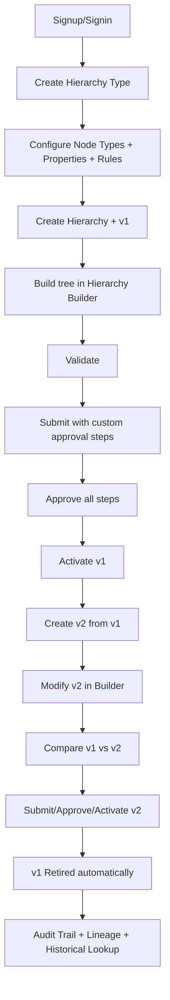

# SCM Hierarchy Management Platform — Implementation Plan

## Current State

The workspace at [`/Users/relanto/Desktop/SPM`](/Users/relanto/Desktop/SPM) is **greenfield**: only [`.cursor/plans/hierarchy_data_model_c78ee789.plan.md`](/Users/relanto/Desktop/SPM/.cursor/plans/hierarchy_data_model_c78ee789.plan.md) exists. The ER model (12 entities, composite uniques, lifecycle rules) is already documented there and will be the schema source of truth.

## Architecture Overview



**Request flow** (all mutations): `React UI → Axios (JWT) → Router → Service → Validator → Repository → SQLite → HIERARCHY_CHANGE audit → Response`

## Key Design Decisions

| Decision | Choice | Rationale |
|----------|--------|-----------|
| Auth | JWT signup/signin with bcrypt passwords | User requested username/password auth |
| User identity | New `USER` table; `created_by`/`changed_by` store username | Fits audit fields in spec |
| Approval steps | **User defines steps at submit time** (UI form: sequence + approver role/user) | User requested prompt-at-submit, not pre-configured |
| Approval acting | Any authenticated user can act on a pending step matching their username or role | Demo-friendly; roles stored on user profile |
| Drag-and-drop | `@dnd-kit/core` + `@dnd-kit/sortable` | Modern, maintained, works with React 18 |
| Lineage viz | `reactflow` (lightweight graph) | Good for version/node lineage without heavy deps |
| Tree builder | Custom `TreeView` + recursive API tree payload | Keeps control over SCM-specific actions |
| IDs | UUID v4 everywhere | Per spec |
| Soft delete | `node_status = REMOVED` on version nodes | Preserves audit/history per existing plan |

## Project Structure

Create exactly two top-level folders as specified:

```
SPM/
├── backend/
│   ├── app/
│   │   ├── main.py              # FastAPI app, CORS, startup seed
│   │   ├── config.py            # pydantic-settings (.env)
│   │   ├── database.py          # engine, SessionLocal, Base
│   │   ├── dependencies.py      # get_db, get_current_user
│   │   ├── models/              # 13 models (12 + USER)
│   │   ├── schemas/             # Pydantic request/response
│   │   ├── routers/             # One router per domain
│   │   ├── services/            # Business logic
│   │   ├── repositories/        # DB queries
│   │   ├── validators/          # Structural/property/version rules
│   │   └── utils/               # enums, cycle detection, diff helpers
│   ├── alembic/
│   ├── tests/
│   ├── requirements.txt
│   ├── .env.example
│   └── README.md
└── frontend/
    ├── src/
    │   ├── components/          # Sidebar, DataTable, TreeView, etc.
    │   ├── pages/               # One page per nav item
    │   ├── layouts/             # AppLayout with sidebar/header
    │   ├── services/            # api.js, auth.js
    │   ├── hooks/               # useAuth, useToast, useFetch
    │   ├── types/               # JSDoc or .ts if preferred — use .jsx per spec
    │   ├── utils/
    │   └── App.jsx
    ├── package.json
    └── README.md
```

## Phase 1 — Foundation

### Backend bootstrap
- [`backend/requirements.txt`](backend/requirements.txt): `fastapi`, `uvicorn[standard]`, `sqlalchemy`, `alembic`, `pydantic-settings`, `python-jose[cryptography]`, `passlib[bcrypt]`, `python-multipart`
- [`backend/app/config.py`](backend/app/config.py): `DATABASE_URL`, `CORS_ORIGINS`, `JWT_SECRET`, `JWT_ALGORITHM`, `ACCESS_TOKEN_EXPIRE_MINUTES`
- [`backend/app/database.py`](backend/app/database.py): SQLite engine with `check_same_thread=False`
- [`backend/app/main.py`](backend/app/main.py): mount routers, CORS, `/docs`, startup hook to seed if empty
- Alembic init + initial migration

### Auth (new `USER` model — required for signup/signin)
```python
# backend/app/models/user.py
class User(Base):
    id: UUID PK
    username: str UK
    password_hash: str
    display_name: str
    role: str          # e.g. "Supply Chain Manager", "Business Owner"
    is_active: bool
    created_at: datetime
```

**Endpoints:**
- `POST /api/auth/signup` — create user
- `POST /api/auth/signin` — return JWT
- `GET /api/auth/me` — current user profile

**Dependencies:** `get_current_user` decodes JWT; all write endpoints require auth.

### Frontend bootstrap
- Vite + React + Tailwind + React Router + Axios + Lucide
- [`frontend/src/layouts/AppLayout.jsx`](frontend/src/layouts/AppLayout.jsx): sidebar (per spec nav tree), header (user menu, logout), breadcrumbs slot
- [`frontend/src/pages/LoginPage.jsx`](frontend/src/pages/LoginPage.jsx), [`SignupPage.jsx`](frontend/src/pages/SignupPage.jsx)
- [`frontend/src/services/api.js`](frontend/src/services/api.js): Axios instance with JWT interceptor
- Protected routes via `AuthGuard` wrapper
- Toast provider, loading/error/empty state primitives

## Phase 2 — Data Model (12 entities + indexes)

Implement SQLAlchemy models mirroring the existing plan exactly:

| Model | Key constraints |
|-------|-----------------|
| `HierarchyType` | UK `code`; `allow_multiple_parents` |
| `Hierarchy` | UK `(hierarchy_type_id, code)` |
| `NodeType` | UK `(hierarchy_type_id, code)` |
| `NodePropertyDefinition` | UK `(hierarchy_type_id, node_type_id, property_code)` |
| `StructuralRule` | UK `(hierarchy_type_id, parent_node_type_id, child_node_type_id)` |
| `HierarchyNode` | UK `(hierarchy_id, stable_code)` |
| `HierarchyVersion` | self-FK `based_on_version_id`; status enum |
| `HierarchyVersionNode` | UK `(hierarchy_version_id, hierarchy_node_id)`; JSON `properties` |
| `HierarchyEdge` | UK tree: `(hierarchy_version_id, child_version_node_id)` when single-parent |
| `ApprovalRequest`, `ApprovalStep` | sequential steps |
| `HierarchyCopyLineage` | operation_type enum |
| `HierarchyChange` | append-only audit |

**Enums** in [`backend/app/utils/enums.py`](backend/app/utils/enums.py):
- Version status: `DRAFT`, `PENDING_APPROVAL`, `APPROVED`, `ACTIVE`, `REJECTED`, `RETIRED`, `CANCELLED`
- Node status: `ACTIVE`, `REMOVED`
- Property data types: `STRING`, `NUMBER`, `DATE`, `BOOLEAN`, `ENUM`, `REFERENCE`
- Change actions: `CREATE`, `UPDATE`, `COPY`, `MOVE`, `DELETE`, `SUBMIT`, `APPROVE`, `REJECT`, `ACTIVATE`, `RETIRE`, `CANCEL`

**Alembic migration** creates all tables + indexes from the plan (effective-date, tree traversal, audit).

## Phase 3 — Configuration CRUD

### Services + repositories pattern
Each domain: `Repository` (queries) → `Service` (rules + audit) → `Router` (HTTP)

| Router prefix | Operations |
|---------------|------------|
| `/api/hierarchy-types` | CRUD, activate/deactivate, delete w/ dependency check |
| `/api/hierarchies` | CRUD, detail w/ active version, latest draft, versions list |
| `/api/node-types` | CRUD, reorder (`display_order` batch update) |
| `/api/property-definitions` | CRUD, filter by hierarchy type / node type |
| `/api/structural-rules` | CRUD, validate parent≠child |

### Frontend pages
- [`HierarchyTypesPage`](frontend/src/pages/HierarchyTypesPage.jsx) — table, search, status filter, create/edit modal
- [`HierarchiesPage`](frontend/src/pages/HierarchiesPage.jsx) + [`HierarchyDetailPage`](frontend/src/pages/HierarchyDetailPage.jsx)
- [`NodeTypesPage`](frontend/src/pages/NodeTypesPage.jsx)
- [`PropertyDefinitionsPage`](frontend/src/pages/PropertyDefinitionsPage.jsx) — dynamic form by datatype
- [`StructuralRulesPage`](frontend/src/pages/StructuralRulesPage.jsx)

**Reusable components:** `DataTable`, `SearchBar`, `FilterPanel`, `StatusBadge`, `Modal`, `ConfirmDialog`, `PropertyFieldRenderer`

## Phase 4 — Version Management

### [`VersionService`](backend/app/services/version_service.py)
- `create_initial_version(hierarchy_id)` → v1 Draft
- `create_from_version(source_id)` → deep copy:
  - All `HierarchyVersionNode` rows (new IDs, same `hierarchy_node_id`)
  - All `HierarchyEdge` rows remapped to new version_node IDs
  - `based_on_version_id` set; status `DRAFT`
  - `HIERARCHY_COPY_LINEAGE` records with `operation_type=COPY_SUBTREE` for each copied node
  - Source version untouched
- `cancel_version` (Draft → Cancelled)
- **Version lock guard:** `assert_editable(version)` — only `DRAFT` and `REJECTED` (before return-to-draft) allow writes

### Lifecycle state machine in [`VersionLifecycleService`](backend/app/services/version_lifecycle_service.py)



Valid transitions enforced in service layer; routers return `409 Conflict` on invalid transitions.

### Frontend
- [`VersionsPage`](frontend/src/pages/VersionsPage.jsx) — list/filter by hierarchy, status
- Version detail drawer with metadata form (valid_from/to, version_name)
- Actions: Create from version, Cancel (draft only)

## Phase 5 — Hierarchy Builder

### Backend tree API
- `GET /api/versions/{id}/tree` → nested JSON `{ version_node_id, display_name, node_type, children[], properties, sibling_order }`
- `POST /api/versions/{id}/nodes` — add node (creates `HierarchyNode` + `HierarchyVersionNode` + optional `HierarchyEdge`)
- `PATCH /api/versions/{id}/nodes/{node_id}` — edit name, properties, sibling_order
- `DELETE /api/versions/{id}/nodes/{node_id}` — soft remove subtree (set `node_status=REMOVED`, remove edges)
- `POST /api/versions/{id}/nodes/{node_id}/move` — re-parent with validation
- `POST /api/versions/{id}/nodes/{node_id}/clone` — new logical node + lineage `CLONE`
- `POST /api/versions/{id}/copy-subtree` — cross-version copy with lineage

### [`NodeService`](backend/app/services/node_service.py) business rules (backend-enforced)
1. Check version editable
2. Resolve allowed child types from `STRUCTURAL_RULE` for parent node type
3. Single-parent: reject second parent edge
4. Cycle detection via BFS/DFS up from target parent ([`backend/app/utils/cycle.py`](backend/app/utils/cycle.py))
5. Property validation via [`PropertyValidator`](backend/app/validators/property_validator.py)
6. Write `HIERARCHY_CHANGE` for every field change

### Frontend [`HierarchyBuilderPage`](frontend/src/pages/HierarchyBuilderPage.jsx)
- Version selector at top
- Read-only banner when version locked
- `TreeView` with expand/collapse, search/filter
- Side drawer `NodeEditor` with dynamic `PropertyEditor`
- Add node wizard: pick parent → filtered node types → name + properties
- Drag-and-drop reorder siblings + move (via `@dnd-kit`)
- Confirm dialog for delete showing impacted subtree count

## Phase 6 — Validation Engine

### [`ValidationService`](backend/app/services/validation_service.py)
`POST /api/versions/{id}/validate` returns:

```json
{
  "valid": false,
  "errors": [{ "type": "STRUCTURAL", "node_id": "...", "message": "..." }],
  "warnings": []
}
```

**Checks:**
| Category | Rules |
|----------|-------|
| Structural | Valid roots, allowed parent-child types, single/multi parent, no cycles, no orphan non-root nodes |
| Property | Required, datatype, enum allowed_values, validation_rule (simple: regex, numeric bounds) |
| Version | valid_from ≤ valid_to, no overlapping ACTIVE/APPROVED periods for same hierarchy |

Frontend [`ValidationPage`](frontend/src/pages/ValidationPage.jsx): run validation, display grouped errors/warnings via `ValidationPanel`.

## Phase 7 — Approval Workflow

### Submit with user-defined steps
`POST /api/versions/{id}/submit` body:

```json
{
  "comment": "Restructured beverage category",
  "approval_steps": [
    { "step_sequence": 1, "approver_role_or_user": "Supply Chain Manager" },
    { "step_sequence": 2, "approver_role_or_user": "data_governance" },
    { "step_sequence": 3, "approver_role_or_user": "Business Owner" }
  ]
}
```

**Flow:**
1. Run validation; block if errors
2. Create `ApprovalRequest` (status OPEN)
3. Create `ApprovalStep` rows (status PENDING)
4. Set version → `PENDING_APPROVAL` (locked)

### Acting on steps
- `POST /api/approval-requests/{id}/steps/{step_id}/approve`
- `POST /api/approval-requests/{id}/steps/{step_id}/reject` (requires comment)
- Sequential: only current pending step (lowest sequence) can be acted on
- Actor must match `approver_role_or_user` (username or role on JWT user)
- All approved → version `APPROVED`; any reject → version `REJECTED`
- `return_to_draft` on rejected version → `DRAFT` (editable again)

### Frontend
- Submit modal: comment + dynamic step builder (add/remove/reorder approvers)
- [`ApprovalRequestsPage`](frontend/src/pages/ApprovalRequestsPage.jsx) with `ApprovalTimeline` component
- Pending approvals for current user highlighted on Dashboard

## Phase 8 — Activation & Retirement

### [`ActivationService`](backend/app/services/activation_service.py)
- `POST /api/versions/{id}/activate` with optional `valid_from` (default today)
- Preconditions: status `APPROVED`
- Sets status `ACTIVE`, assigns `valid_from`
- Finds current ACTIVE version for same hierarchy → sets `RETIRED`, `valid_to = valid_from - 1 day`
- Future-dated: version stays `APPROVED` until `valid_from`; background job on startup checks and activates (simple scheduler in `main.py` lifespan or activate-on-read for demo)
- Audit: `ACTIVATE`, `RETIRE` change records

## Phase 9 — Governance Features

### Compare versions
- `GET /api/versions/{id}/compare/{other_id}` → [`ComparisonService`](backend/app/services/comparison_service.py)
- Diff algorithm: match by `hierarchy_node_id` across versions
- Categories: ADDED, REMOVED, MOVED, RENAMED, PROPERTY_CHANGED, RELATIONSHIP_CHANGED
- Frontend [`CompareVersionsPage`](frontend/src/pages/CompareVersionsPage.jsx): version pickers, `ChangeSummary` cards, filterable `ChangeTable`

### Historical lookup
- `GET /api/hierarchies/{id}/versions/effective?business_date=2026-08-15`
- Query: `status=ACTIVE AND business_date BETWEEN valid_from AND COALESCE(valid_to, '9999-12-31')`
- Expose on Hierarchy detail + dedicated lookup widget

### Audit trail
- `GET /api/audit` with filters: user, action, entity_type, version_id, date_from, date_to
- Frontend [`AuditTrailPage`](frontend/src/pages/AuditTrailPage.jsx): read-only `AuditTable`

### Lineage
- `GET /api/lineage?hierarchy_id=&version_id=&node_id=` → nodes + edges for `LineageGraph`
- Combines `HIERARCHY_VERSION.based_on_version_id` chain + `HIERARCHY_COPY_LINEAGE` records
- Frontend [`LineagePage`](frontend/src/pages/LineagePage.jsx) with `reactflow`

### Dashboard
- `GET /api/dashboard/stats` — counts + recent activity + versions approaching effective date
- [`DashboardPage`](frontend/src/pages/DashboardPage.jsx) with stat cards + recent changes list

## Phase 10 — Seed Data, Tests, Polish

### Seed script [`backend/app/utils/seed.py`](backend/app/utils/seed.py)
Run on first startup (if no hierarchy types exist):

1. **Users:** admin, scm_manager, data_governance, business_owner (with roles)
2. **Hierarchy type:** PRODUCT (single parent)
3. **Node types:** Category → Sub Category → Brand → Product → SKU
4. **Structural rules:** chain above
5. **Property definitions:** e.g. Product Code (STRING, required), Pack Size (STRING), Status (ENUM)
6. **Hierarchy:** Global Product Hierarchy
7. **v1 (ACTIVE):** full Beverages/Snacks tree from spec
8. **v2 (DRAFT):** copied from v1 with intentional diffs (renamed node, moved product, added SKU, removed item) for compare demo

### Backend tests [`backend/tests/`](backend/tests/)
pytest + httpx TestClient covering:
- Auth signup/signin
- CRUD hierarchy type
- Create version + copy version (source unchanged)
- Add node + invalid parent-child (400)
- Cycle prevention (409)
- Required property + enum validation
- Submit blocked on validation failure
- Approval chain + rejection → return to draft
- Activation + auto-retire previous
- Compare diff categories
- Historical lookup by date

### Frontend tests (minimal)
- Vitest: `StatusBadge`, `PropertyFieldRenderer`, auth guard redirect

### Error handling
- Backend: custom exception handlers → `{ detail, code, errors[] }` with proper HTTP status
- Frontend: map API errors to toast + inline field errors

### README files
- Backend: venv, alembic, uvicorn, env vars, default seeded users
- Frontend: npm install, dev server, proxy to `:8000`

## API Surface (complete)

```
POST   /api/auth/signup|signin
GET    /api/auth/me
GET    /api/dashboard/stats

/api/hierarchy-types          CRUD
/api/hierarchies              CRUD + /{id}/versions + /{id}/versions/effective
/api/versions/{id}            GET/PATCH
/api/versions/{id}/tree       GET
/api/versions/{id}/nodes      POST
/api/versions/{id}/nodes/{nid} PATCH/DELETE
/api/versions/{id}/nodes/{nid}/move|clone POST
/api/versions/{id}/copy-subtree POST
/api/versions/{id}/validate   POST
/api/versions/{id}/submit     POST
/api/versions/{id}/activate   POST
/api/versions/{id}/return-to-draft POST
/api/versions/{id}/compare/{other} GET

/api/node-types               CRUD + reorder
/api/property-definitions     CRUD
/api/structural-rules         CRUD

/api/approval-requests        GET
/api/approval-requests/{id}/steps/{sid}/approve|reject POST

/api/audit                    GET (filtered)
/api/lineage                  GET (filtered)
```

## Acceptance Journey Mapping

The seeded demo + UI supports the full path from the spec without manual DB edits:



## Implementation Order & Estimates

Build strictly in phase order; each phase is testable before moving on.

| Phase | Deliverable | Depends on |
|-------|-------------|------------|
| 1 | Running app shell + auth | — |
| 2 | All models + migration | 1 |
| 3 | Config CRUD + UI pages | 2 |
| 4 | Version create/copy/lifecycle | 3 |
| 5 | Hierarchy builder | 4 |
| 6 | Validation engine | 5 |
| 7 | Submit + approval | 6 |
| 8 | Activation/retirement | 7 |
| 9 | Compare, audit, lineage, dashboard | 8 |
| 10 | Seed, tests, polish | 9 |

## Risk Mitigations

- **SQLite concurrency:** single-process uvicorn is fine for demo; document limitation in README
- **Cross-version copy complexity:** implement copy first in `VersionService.create_from_version`, reuse same logic for manual subtree copy
- **Large tree performance:** paginate audit; lazy-load tree children if needed (initially full tree is OK for seed size)
- **REFERENCE property type:** validate against existing node `stable_code` in same hierarchy; UI shows searchable dropdown
